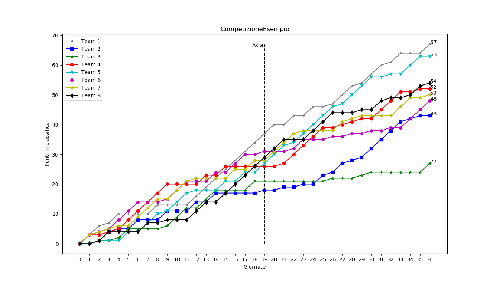

# andamento-classifica-fantacalcio

Script per generare immagine dell'andamento della classifica della tua lega fantacalcio su leghe.fantacalcio.it. Ideato solo per competizioni a calendario.
Un esempio:

## Requisiti
* python 3
* pandas>=1.1.4
* matplotlib>=3.0.2

## Utilizzo
* Scarica il codice
* Scarica il calendario della tua lega (in qualsiasi momento del campionato) in formato .xlsx dalla sezione "CALENDARIO" del sito di leghe fantacalcio e copialo nello stesso folder del codice
* Da riga di comando, lancia il comando `python andamento_classifica.py nome-file-excel.xlsx`sostituendo "nome-file-excel.xlsx" col nome del file che hai scaricato.
Puoi generare l'immagine di esempio con `python andamento_classifica.py Calendario_CompetizioneEsempio.xlsx`

## Parametri opzionali
* `-q`: salva l'immagine creata senza mostrarla
* `-f1`: genera anche l'immagine dell'andamento della classifica simulando una competizione a Formula 1 anziché a calendario
* `-asta ASTA`: specifica la prima giornata successiva all'asta di riparazione

## Problemi noti
* Testato solo su competizione a 8 squadre. Dovrebbe funzionare comunque con un numero di squadre inferiore a 8, ma potrebbe non funzionare con un numero superiore
* Non è prevista la presenza di giornate non calcolate
